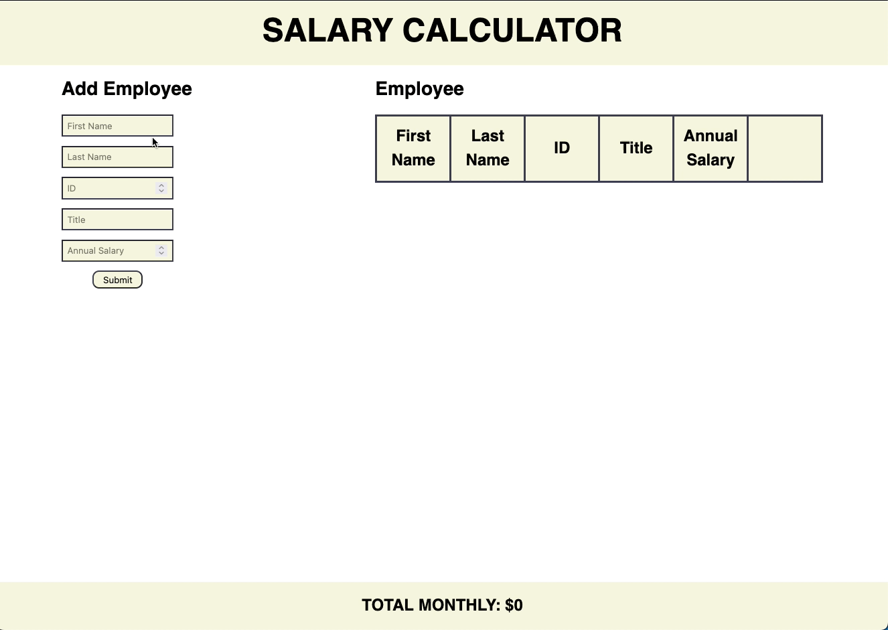

# JQuery Salary Calculator:

## Description

_Duration: 18 hour Sprint_

Over the course of a weekend, the goal was to create a functional web based application. The web based application allow users to calculate monthly salary by allowing users to add employees and their salary.

## Screen Shots
GIF showing application features:

### Prerequisites
- Any Browser

## Installation
1. Clone this repository for your own access.
2. Open up the index.html file in your browser of choice.

## Usage
This web application is meant to create an interactive salary calculator:
 1. Users can add employees to the table.
 2. The total monthly salary for the company will be displayed at the bottom.
 3. Users can delete any employee they have added to the table

## Acknowledgement
Thanks to [Prime Digital Academy](www.primeacademy.io) who equipped and helped me to make this application a reality.

## Support
If you have suggestions or issues, please email me at [paulhoanglong@gmail.com](www.google.com)